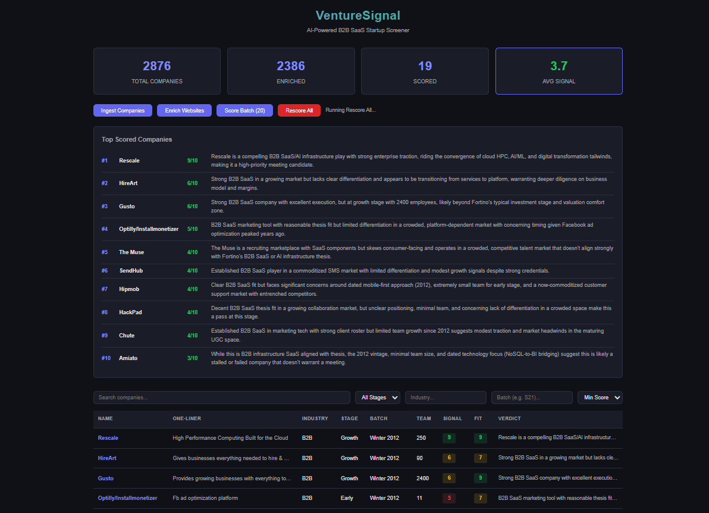

# VentureSignal

AI-powered B2B SaaS startup screener built for venture capital deal-sourcing.

VentureSignal ingests ~2,300 B2B startups from the YC-OSS API, enriches them by scraping company websites, scores each one via Claude AI against a configurable VC investment thesis, and surfaces results through an interactive React dashboard.



## Tech Stack

| Layer | Technology |
|-------|-----------|
| Backend | Python 3.11 + FastAPI |
| LLM | Anthropic Claude API |
| Database | SQLite (dev) / PostgreSQL (prod) |
| Frontend | React 18 + TypeScript 5 |
| Scraping | httpx + BeautifulSoup4 |
| Infra | Docker + docker-compose |

## Quick Start

### Prerequisites

- Python 3.11+
- Node.js 20+
- An Anthropic API key

### Backend

```bash
cd backend
cp .env.example .env
# Edit .env with your ANTHROPIC_API_KEY
pip install -r requirements.txt
uvicorn src.main:app --reload --port 8000
```

### Frontend

```bash
cd frontend
npm install
npm run dev
```

Open http://localhost:5173 to view the dashboard.

### Using the Pipeline

1. **Ingest companies** — click "Ingest Companies" in the dashboard or `POST /api/ingest`
2. **Enrich websites** — click "Enrich Websites" or `POST /api/enrich`
3. **Score with AI** — click "Score Batch (20)" or `POST /api/score?batch_size=20`

### Docker

```bash
docker compose up --build
```

- Backend: http://localhost:8000 (API docs at `/docs`) 
- Frontend: http://localhost:3000

## API Endpoints

| Method | Path | Description |
|--------|------|-------------|
| GET | `/api/companies` | List companies with filters |
| GET | `/api/companies/{id}` | Company detail + scores |
| POST | `/api/ingest` | Trigger YC-OSS data ingestion |
| POST | `/api/enrich` | Trigger website enrichment |
| POST | `/api/score` | Trigger LLM scoring batch |
| GET | `/api/stats` | Dashboard summary stats |

## Scoring Dimensions

Each company is scored 1-10 across five dimensions:

- **Thesis Fit** — B2B SaaS or AI infrastructure alignment
- **Market Timing** — Growing or emerging market
- **Product Clarity** — Clear, differentiated value proposition
- **Team Signal** — Team size relative to stage suggests traction
- **Overall Signal** — First meeting recommendation

## Project Structure

```
venturesignal/
├── backend/
│   └── src/
│       ├── main.py          # FastAPI app
│       ├── config.py         # Settings
│       ├── models/           # Pydantic + SQLAlchemy models
│       ├── services/         # Ingest, enrich, scorer
│       ├── api/routes.py     # REST endpoints
│       ├── db/database.py    # DB setup
│       └── prompts/thesis.txt
├── frontend/
│   └── src/
│       ├── App.tsx
│       ├── components/       # Dashboard, Table, Card, Filters
│       └── services/api.ts
└── docker-compose.yml
```

## License

MIT
